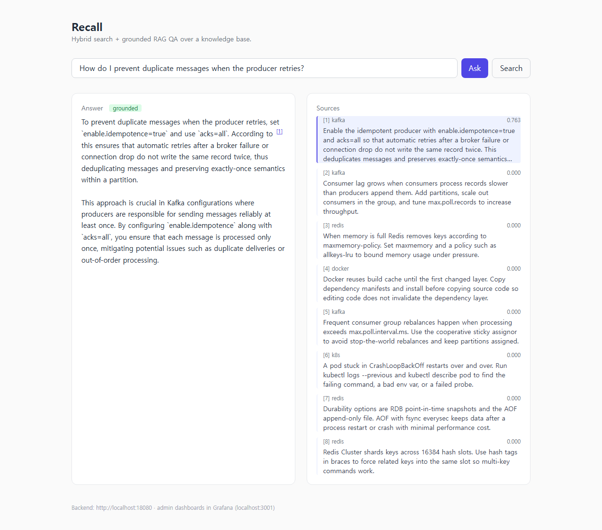
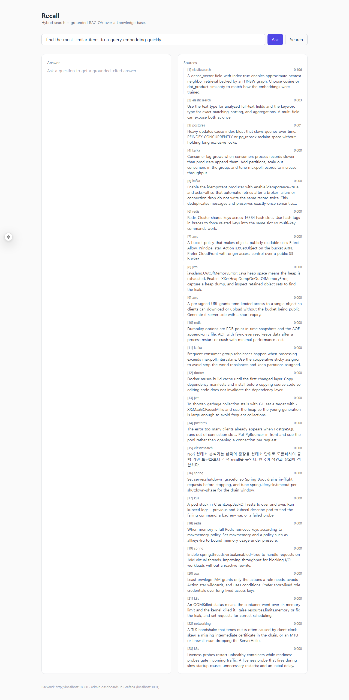
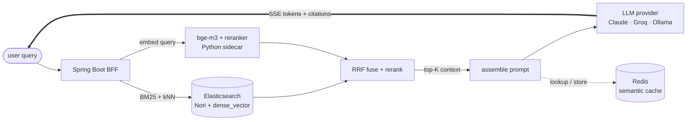
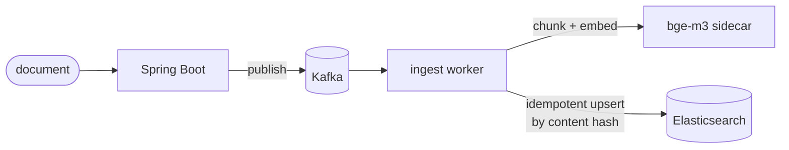

# Recall — AI Hybrid Search & RAG QA Platform

Hybrid (BM25 + dense vector) search and grounded RAG question-answering over a technical
knowledge base — built as a **backend engineering problem**, not a thin LLM wrapper. The
hard parts are retrieval quality, latency budgets, LLM cost control, and groundedness —
all measured, not asserted.

[](https://github.com/jinwovo/recall/actions/workflows/ci.yml)

> Status: active build. Verified end-to-end on Docker Compose — the full stack (Elasticsearch
> with Nori, Redis, Postgres, Kafka, embedding sidecar, backend) runs, and the RAG QA path
> works with a free local LLM (Ollama). Backend unit tests, a Testcontainers integration test
> (ES 8 + Nori) proving idempotent ingestion under concurrency, frontend build, sidecar syntax
> check, and `helm lint` pass in CI. This README is honest about what runs today vs. what is
> planned.

## Demo

Grounded RAG QA — a streamed answer with an inline `[n]` citation; clicking the citation
highlights the cited source, and the green **grounded** badge is the post-hoc LLM judge's
verdict (ADR 0004). The answer below is generated by a free local LLM (Ollama):



Hybrid search view — sources ranked by fused score:



## The problem

Most "AI search" demos call an LLM once and stop. The interesting part isn't "ask a model a
question" — it's returning the *right* passages and a *grounded* answer, fast and cheaply,
when the corpus is large and multilingual. That means: lexical and semantic retrieval have to
cooperate, answers must cite their sources (and say "I don't know" when there are none), and
the LLM has to be treated as a cost/latency budget you actively manage.

## Architecture

Query / RAG path:



Ingestion path — async and idempotent:



Design decisions and trade-offs are recorded in [`docs/adr/`](docs/adr/); component detail in
[`docs/ARCHITECTURE.md`](docs/ARCHITECTURE.md).

## Engineering challenges

| Challenge | What it demonstrates | Tracked metric |
|---|---|---|
| Hybrid retrieval (BM25 + vector + RRF + rerank) | Search / IR depth, fusion tuning | Recall@K, MRR@K, nDCG@K |
| RAG with `[n]` citations + groundedness guardrail | Grounded generation, post-hoc LLM-judge verification, "I don't know" handling | groundedness %, citation coverage |
| LLM cost & latency control | Model tiering, prompt caching, semantic cache, batch | $/query, cache hit rate, % saved |
| Multilingual KO/EN | Korean morphology (Nori) + multilingual embeddings | per-language recall, cross-lingual hits |
| Async ingestion | Concurrency, idempotency (proven by a Testcontainers IT: 200 concurrent duplicate upserts → 1 document), incremental indexing | docs/s, zero dup/loss |
| Eval-driven development | Measured iteration, CI regression gate | eval trend |
| Pluggable LLM provider | Provider abstraction (Claude / Groq / Ollama) | — |

## Measured results

Measured end-to-end on the running stack over a 24-document technical corpus with a 10-query
gold set (exact-term, paraphrased, and Korean cross-lingual), via
[`eval/run_eval.py`](eval/run_eval.py):

| mode | Recall@5 | Recall@10 | MRR@10 | nDCG@10 |
|---|:---:|:---:|:---:|:---:|
| BM25-only | 0.70 | 0.80 | 0.67 | 0.70 |
| vector-only | 1.00 | 1.00 | 0.90 | 0.93 |
| **hybrid (RRF + rerank)** | **1.00** | **1.00** | **0.95** | **0.96** |

Hybrid lifts Recall@5 by **+0.30 over BM25** and MRR@10 from 0.67 to **0.95**: exact-term
queries favor BM25, paraphrased/Korean queries favor dense vectors, and RRF + the
cross-encoder reranker combine both.

### RAG answer quality (groundedness)

Measured on the same stack and gold set via [`eval/run_qa_eval.py`](eval/run_qa_eval.py),
with the **free local provider** (Ollama, `qwen2.5-coder:3b` on CPU) doing both generation
and judging:

| metric | value |
|---|---|
| groundedness (avg judge score) | **0.81** |
| verdicts (8 judged) | 75% supported · 12% partial · 12% unsupported |
| abstentions ("I don't know") | 2/10 — declined instead of hallucinating |
| citation coverage | **100%** of generated answers contain `[n]` citations |
| TTFT p50 / e2e p50 | 30.5s / 54s *(local CPU 3B — prefill-bound; not representative of API providers)* |

The one `UNSUPPORTED` answer was flagged by the judge and excluded from the semantic cache
(ADR 0004) — the guardrail producing signal, not just a green checkmark. Latency is dominated
by CPU prefill of the 8-passage context; the same pipeline on an API-tier model moves TTFT to
sub-second territory.

## Tech stack

- **Backend:** Java 21, Spring Boot, WebFlux (SSE)
- **LLM:** pluggable via `recall.llm.provider` — Claude (`com.anthropic:anthropic-java`, default), or OpenAI-compatible Groq / Ollama (local, free, no key)
- **Search / vector:** Elasticsearch (Nori analyzer + `dense_vector` kNN)
- **Embedding / rerank:** `BAAI/bge-m3` + `BAAI/bge-reranker-v2-m3` (Python FastAPI sidecar)
- **Messaging:** Kafka (async ingestion)
- **Stores:** Redis (semantic cache, locks), PostgreSQL (query/cost log), MinIO/S3 (raw docs)
- **Frontend:** Next.js, TypeScript, Tailwind
- **Observability:** Micrometer + Prometheus + Grafana
- **Quality / infra:** Testcontainers, k6, GitHub Actions, Docker Compose, Helm

## Quickstart

```bash
cp .env.example .env                 # optional: ANTHROPIC_API_KEY, or use the free Ollama provider
docker compose up -d                 # ES (Nori), Redis, Postgres, Kafka, MinIO, sidecar, Prometheus, Grafana
cd backend && gradle wrapper && ./gradlew bootRun
cd frontend && npm install && npm run dev      # http://localhost:3000

./scripts/seed.sh                              # ingest sample docs
cd eval && python run_eval.py gold.jsonl       # bm25 vs vector vs hybrid comparison
```

To run the RAG answer for free with no API key, set `LLM_PROVIDER=ollama` (and have Ollama
running locally) — see [Configuration](#configuration).

## API

| Method | Path | Notes |
|---|---|---|
| `GET` | `/api/search?q=&mode=` | `mode` = `hybrid` (default) `\|` `bm25` `\|` `vector` |
| `GET` | `/api/ask?q=` | SSE stream: `sources`, `token`, `judging`, `groundedness`, `done`; grounded answer with `[n]` citations |
| `POST` | `/api/ingest` | async index a document (returns `202`) |
| `GET` | `/actuator/prometheus` | metrics scrape |

## Configuration

LLM provider is selected by `recall.llm.provider` (env `LLM_PROVIDER`):

| Provider | Cost | Notes |
|---|---|---|
| `claude` (default) | paid | `ANTHROPIC_API_KEY`; supports Claude native citations |
| `groq` | free tier | `GROQ_API_KEY`, OpenAI-compatible |
| `ollama` | free / local | no key; `OLLAMA_MODEL` (e.g. `qwen2.5-coder:3b`) |

### Groundedness guardrail

Every generated answer is graded **after** it streams (so TTFT is unaffected) by a post-hoc
LLM-judge on the cheap model tier: the judge sees the same passages plus the finished answer
and returns `SUPPORTED` / `PARTIAL` / `UNSUPPORTED`. The verdict streams to the UI as a badge,
lands on the `query_log` row, and feeds Prometheus (`recall_rag_groundedness`,
`recall_rag_judge_verdicts_total`) — so "groundedness %" is a dashboard number, not a claim.
The judge is fail-open (timeout/error → answer unaffected) and abstentions ("I don't know")
are never graded as hallucinations. Design: [ADR 0004](docs/adr/0004-groundedness-guardrail.md).

## Observability

Micrometer metrics exported to Prometheus and a provisioned Grafana dashboard
(**Recall — Overview**): LLM tokens by model, semantic-cache hits, retrieval p95 by mode,
groundedness verdicts, and ingestion throughput. Grafana at `localhost:3001`, Prometheus at
`localhost:9090`.

## Project layout

```
backend/            Spring Boot (Java 21) — search, rag, ingestion, llm providers, cache
embedding-service/  Python FastAPI sidecar — bge-m3 embeddings + bge-reranker
frontend/           Next.js UI — search / QA, streamed answers, citation highlight
eval/               eval harness (Recall@K / MRR / nDCG) + corpus + gold set
deploy/helm/recall/ Helm chart (k8s) for backend + sidecar
monitoring/         Prometheus + Grafana provisioning
docs/               PROJECT_PLAN, ARCHITECTURE, ADRs
docker-compose.yml
```

## Roadmap

- Claude native citations (exact char-span grounding) when the `claude` provider is configured
- Groundedness % measured over the eval gold set; eval regression gate in CI
- MinIO raw-doc storage on the ingestion path; dead-letter + retry

## Decision records

- [ADR 0001 — Hybrid retrieval (BM25 + vector + RRF + rerank)](docs/adr/0001-hybrid-retrieval-bm25-vector-rrf.md)
- [ADR 0002 — LLM cost & latency optimization](docs/adr/0002-llm-cost-optimization-strategy.md)
- [ADR 0003 — Async, idempotent ingestion via Kafka](docs/adr/0003-async-ingestion-kafka.md)
- [ADR 0004 — Post-hoc groundedness judge (hallucination guardrail)](docs/adr/0004-groundedness-guardrail.md)

## 한국어 요약

기술 지식베이스 대상 **하이브리드 검색(BM25+벡터) + RAG 질의응답** 플랫폼. "LLM API 한 번 호출"이
아니라 **검색 정합성 · 지연 · 비용 · 근거(citation)** 를 설계하고 숫자로 측정합니다. LLM은 Claude /
Groq / **Ollama(로컬·무료)** 중에서 `recall.llm.provider`로 교체 가능. 자세한 계획은
[`docs/PROJECT_PLAN.md`](docs/PROJECT_PLAN.md).

## License

MIT — see [`LICENSE`](LICENSE).
