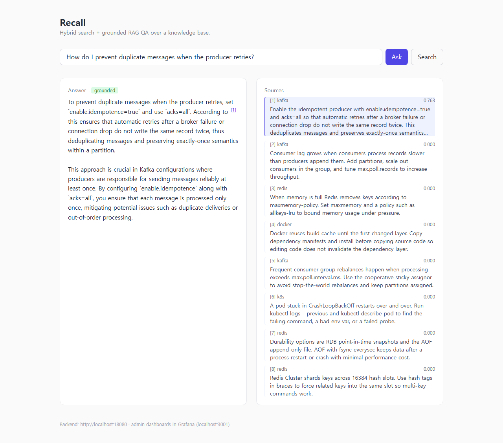
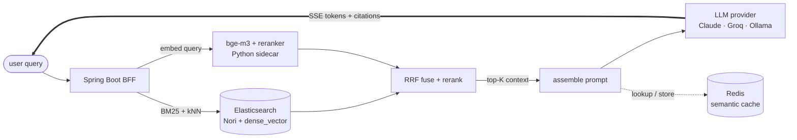

# Recall — AI Hybrid Search & RAG QA Platform

Hybrid (BM25 + dense vector) search and grounded RAG question-answering over a technical
knowledge base — built as a **backend engineering problem**, not a thin LLM wrapper. The
hard parts are retrieval quality, latency budgets, LLM cost control, and groundedness —
all measured, not asserted.

[](https://github.com/jinwovo/recall/actions/workflows/ci.yml)
[](https://github.com/jinwovo/recall/actions/workflows/eval.yml)

> Status: active build. Verified end-to-end on Docker Compose — the full stack (Elasticsearch
> with Nori, Redis, Postgres, Kafka, MinIO, embedding sidecar, backend) runs, and the RAG QA
> path works with a free local LLM (Ollama). CI runs backend unit tests plus three Testcontainers
> integration suites — idempotent ingestion under concurrency (real ES 8 + Nori), the
> retry/DLQ/claim-check failure policy, and DLQ replay recovery (real Kafka + MinIO) — along
> with the frontend build, sidecar syntax check, and `helm lint`. A separate **eval workflow
> boots the real retrieval stack and fails the build if hybrid quality regresses** (ADR 0007).
> This README is honest about what runs today vs. what is planned.

## Demo

Grounded RAG QA, live (4×) — a **Korean question over an English corpus** (cross-lingual
retrieval via bge-m3): the answer streams token-by-token with inline `[n]` citations while
the pipeline stepper tracks **retrieve → generate → verify**; the **grounded** badge is the
post-hoc LLM judge's verdict (ADR 0004), and clicking a citation highlights the cited
source. Generation is a free local LLM (Ollama, CPU):


Final state of an English QA run — judge-passed answer, client-measured TTFT / total, and
the cross-encoder concentrating its score on the actually-relevant source:



Hybrid search view — retrieval-mode toggle (hybrid / bm25 / vector), per-source score bars,
and client-measured latency:


## The problem

Most "AI search" demos call an LLM once and stop. The interesting part isn't "ask a model a
question" — it's returning the *right* passages and a *grounded* answer, fast and cheaply,
when the corpus is large and multilingual. That means: lexical and semantic retrieval have to
cooperate, answers must cite their sources (and say "I don't know" when there are none), and
the LLM has to be treated as a cost/latency budget you actively manage.

## Architecture

Query / RAG path:


```mermaid
flowchart LR
    Q([user query]) --> BFF[Spring Boot BFF]
    BFF -->|embed query| SIDE[bge-m3 + reranker<br/>Python sidecar]
    BFF -->|BM25 + kNN| ES[(Elasticsearch<br/>Nori + dense_vector)]
    ES --> FUSE[RRF fuse + rerank]
    SIDE --> FUSE
    FUSE -->|top-K context| RAG[assemble prompt]
    RAG --> LLM[LLM provider<br/>Claude · Groq · Ollama]
    RAG -.lookup / store.-> REDIS[(Redis<br/>semantic cache)]
    LLM ==>|SSE tokens + citations| Q
```

Ingestion path — async, idempotent, and loss-proof (retry/backoff → DLQ; large docs travel
as MinIO references via the claim-check pattern):


```mermaid
flowchart LR
    DOC([document]) --> API[Spring Boot]
    API -->|archive raw| MINIO[(MinIO)]
    API -->|publish, acks=all| KAFKA[(Kafka)]
    KAFKA --> W[ingest worker]
    W -.claim check<br/>fetch by objectKey.-> MINIO
    W -->|chunk + embed| SIDE[bge-m3 sidecar]
    W -->|idempotent upsert<br/>by content hash| ES[(Elasticsearch)]
    W -->|poison pill or<br/>retries exhausted| DLQ[(dead-letter topic)]
```

Design decisions and trade-offs are recorded in [`docs/adr/`](docs/adr/); component detail in
[`docs/ARCHITECTURE.md`](docs/ARCHITECTURE.md).

## Engineering challenges

| Challenge | What it demonstrates | Tracked metric |
|---|---|---|
| Hybrid retrieval (BM25 + vector + RRF + rerank) | Search / IR depth, fusion tuning | Recall@K, MRR@K, nDCG@K |
| RAG with `[n]` citations + groundedness guardrail | Grounded generation, post-hoc LLM-judge verification, "I don't know" handling | groundedness %, citation coverage |
| LLM cost & latency control | Model tiering, prompt caching, semantic cache, batch | $/query, cache hit rate, % saved |
| Multilingual KO/EN | Korean morphology (Nori) + multilingual embeddings | per-language recall, cross-lingual hits |
| Reliable async ingestion | Idempotency (200 concurrent upserts → 1 doc), retry/backoff + dead-letter queue (poison pills quarantined, nothing silently dropped), claim-check raw storage in MinIO, DLQ inspect/replay ops tooling — each proven by Testcontainers ITs against real ES / Kafka / MinIO | docs/s, DLQ rate, zero dup/loss |
| Eval-driven development | Measured iteration, enforced: retrieval eval runs as a CI gate on every PR | Recall@5 / MRR@10 / nDCG@10 vs thresholds |
| Pluggable LLM provider | Provider abstraction (Claude / Groq / Ollama) | — |

## Measured results

Measured end-to-end on the running stack over a 24-document technical corpus with a 10-query
gold set (exact-term, paraphrased, and Korean cross-lingual), via
[`eval/run_eval.py`](eval/run_eval.py) — doc-level metrics (chunk hits deduplicated by first
occurrence; re-measured after correcting the metric, which previously let one document's
chunks occupy several ranks):

| mode | Recall@5 | Recall@10 | MRR@10 | nDCG@10 |
|---|:---:|:---:|:---:|:---:|
| BM25-only | 0.70 | 0.80 | 0.65 | 0.69 |
| vector-only | 1.00 | 1.00 | 0.88 | 0.91 |
| **hybrid (RRF + cross-encoder)** | **1.00** | **1.00** | **0.93** | **0.95** |
| hybrid, `rerank=m3` (tri-modal self-hybrid) | 1.00 | 1.00 | 0.88 | 0.91 |
| `mode=hyde` (hypothetical-doc kNN, no rerank) | 1.00 | 1.00 | 0.75 | 0.82 |

Hybrid lifts Recall@5 by **+0.30 over BM25** and MRR@10 from 0.65 to **0.93**: exact-term
queries favor BM25, paraphrased/Korean queries favor dense vectors, and RRF + the
cross-encoder reranker combine both — both Korean cross-lingual queries are BM25 misses but
hybrid rank 1.

The paper-mode rows (ADR 0008) are the harness discriminating, not a leaderboard of wins:
the M3 self-hybrid trades **−0.05 MRR for dropping the second model from memory**; HyDE
recovers every document BM25 misses (Recall@5 0.70 → 1.00) with **zero-shot kNN alone**,
but without a rerank stage its ordering is looser — which is exactly why the cross-encoder
hybrid stays the default.

### Eval as a CI regression gate

The table above is not a one-off measurement: the [`eval` workflow](.github/workflows/eval.yml)
re-produces it on every retrieval-affecting PR — real ES + Nori, real bge-m3 sidecar (weights
held in the Actions cache), the corpus seeded through the real Kafka pipeline behind a
[deterministic indexing barrier](scripts/seed_corpus.py) — and **fails the build** if hybrid
drops below Recall@5 ≥ 0.90, MRR@10 ≥ 0.85 or nDCG@10 ≥ 0.85 (thresholds sit under the
measured values by design: the gate catches regressions, it isn't a leaderboard). The mode
comparison and a per-query first-relevant-rank matrix land in the job's step summary, so a
regression shows *which query* fell to *which rank*. Metrics are doc-level (chunk hits
deduplicated). Locally: `make seed-corpus && make eval-gate`. Design: [ADR 0007](docs/adr/0007-eval-ci-regression-gate.md).

### Paper-backed techniques

Every retrieval stage cites its source — and the recent additions were adopted the same
way everything else was: implemented, swept by the eval harness, numbers published
([ADR 0008](docs/adr/0008-paper-backed-retrieval-m3-hyde.md)):

| Technique | Paper | In this repo |
|---|---|---|
| Reciprocal Rank Fusion | Cormack et al., SIGIR 2009 | BM25 + kNN fusion (`rrf-k=60`) |
| Multilingual dense retrieval + cross-encoder rerank | BGE / bge-reranker-v2-m3 — Chen et al., 2024 | embedding sidecar, default rerank |
| **M3 tri-modal self-hybrid** (dense + sparse + ColBERT) | *BGE M3-Embedding*, Chen et al., 2024 | `/api/search?rerank=m3` — the embedder's own sparse + multi-vector heads as an alternative rerank stage, no extra model |
| **HyDE** (hypothetical document embeddings) | Gao et al., ACL 2023 | `/api/search?mode=hyde` — CHEAP-tier LLM writes a hypothetical answer passage, its embedding retrieves; fail-open to vector search |
| Post-hoc LLM-judge grading | LLM-as-judge line of work | groundedness guardrail (ADR 0004) |

GraphRAG / RAPTOR (corpus-global questions) and late chunking (long-document corpora)
were evaluated and deliberately deferred — the rejection reasoning is in ADR 0008.

### RAG answer quality (groundedness)

Measured on the same stack and gold set via [`eval/run_qa_eval.py`](eval/run_qa_eval.py),
with the **free local provider** (Ollama, `qwen2.5-coder:3b` on CPU) doing both generation
and judging:

| metric | value |
|---|---|
| groundedness (avg judge score) | **0.81** |
| verdicts (8 judged) | 75% supported · 12% partial · 12% unsupported |
| abstentions ("I don't know") | 2/10 — declined instead of hallucinating |
| citation coverage | **100%** of generated answers contain `[n]` citations |
| TTFT p50 / e2e p50 | 30.5s / 54s *(local CPU 3B — prefill-bound; not representative of API providers)* |

The one `UNSUPPORTED` answer was flagged by the judge and excluded from the semantic cache
(ADR 0004) — the guardrail producing signal, not just a green checkmark. Latency is dominated
by CPU prefill of the 8-passage context; the same pipeline on an API-tier model moves TTFT to
sub-second territory.

## Tech stack

- **Backend:** Java 21, Spring Boot, WebFlux (SSE)
- **LLM:** pluggable via `recall.llm.provider` — Claude (`com.anthropic:anthropic-java`, default), or OpenAI-compatible Groq / Ollama (local, free, no key)
- **Search / vector:** Elasticsearch (Nori analyzer + `dense_vector` kNN)
- **Embedding / rerank:** `BAAI/bge-m3` + `BAAI/bge-reranker-v2-m3` (Python FastAPI sidecar)
- **Messaging:** Kafka (async ingestion)
- **Stores:** Redis (semantic cache, locks), PostgreSQL (query/cost log), MinIO/S3 (raw-doc archive + claim check)
- **Frontend:** Next.js, TypeScript, Tailwind
- **Observability:** Micrometer + Prometheus + Grafana
- **Quality / infra:** Testcontainers, k6, GitHub Actions, Docker Compose, Helm

## Quickstart

```bash
cp .env.example .env                 # optional: ANTHROPIC_API_KEY, or use the free Ollama provider
docker compose up -d                 # ES (Nori), Redis, Postgres, Kafka, MinIO, sidecar, Prometheus, Grafana
cd backend && gradle wrapper && ./gradlew bootRun
cd frontend && npm install && npm run dev      # http://localhost:3000

python scripts/seed_corpus.py                  # ingest the eval corpus (waits for async indexing)
cd eval && python run_eval.py gold.jsonl       # bm25 vs vector vs hybrid comparison; --gate = CI thresholds
```

To run the RAG answer for free with no API key, set `LLM_PROVIDER=ollama` (and have Ollama
running locally) — see [Configuration](#configuration).

## API

| Method | Path | Notes |
|---|---|---|
| `GET` | `/api/search?q=&mode=&rerank=` | `mode` = `hybrid` (default) `\|` `bm25` `\|` `vector` `\|` `hyde`; `rerank` (hybrid only) = `cross-encoder` (default) `\|` `m3` (ADR 0008) |
| `GET` | `/api/ask?q=` | SSE stream: `sources`, `token`, `judging`, `groundedness`, `done`; grounded answer with `[n]` citations |
| `POST` | `/api/ingest` | async index a document; `202` ⇒ raw doc archived + broker-acked (ADR 0005) |
| `GET` | `/api/admin/dlq?limit=` | DLQ depth + bounded peek with decoded forensic headers (ADR 0006) |
| `POST` | `/api/admin/dlq/replay?max=` | drain pending DLQ records back onto the ingestion topic (ADR 0006) |
| `GET` | `/actuator/prometheus` | metrics scrape |

## Configuration

LLM provider is selected by `recall.llm.provider` (env `LLM_PROVIDER`):

| Provider | Cost | Notes |
|---|---|---|
| `claude` (default) | paid | `ANTHROPIC_API_KEY`; supports Claude native citations |
| `groq` | free tier | `GROQ_API_KEY`, OpenAI-compatible |
| `ollama` | free / local | no key; `OLLAMA_MODEL` (e.g. `qwen2.5-coder:3b`) |

### Groundedness guardrail

Every generated answer is graded **after** it streams (so TTFT is unaffected) by a post-hoc
LLM-judge on the cheap model tier: the judge sees the same passages plus the finished answer
and returns `SUPPORTED` / `PARTIAL` / `UNSUPPORTED`. The verdict streams to the UI as a badge,
lands on the `query_log` row, and feeds Prometheus (`recall_rag_groundedness`,
`recall_rag_judge_verdicts_total`) — so "groundedness %" is a dashboard number, not a claim.
The judge is fail-open (timeout/error → answer unaffected) and abstentions ("I don't know")
are never graded as hallucinations. Design: [ADR 0004](docs/adr/0004-groundedness-guardrail.md).

### Ingestion reliability

`POST /api/ingest` returning 202 is a durability contract, not an optimistic ack: the raw
document is archived to MinIO and the Kafka publish is broker-acknowledged (`acks=all`)
*before* the response. Documents above `INGEST_INLINE_MAX_BYTES` (64 KB) travel through
Kafka as an `objectKey` reference — the claim-check pattern — so document size never fights
broker message limits. On the consumer, transient failures (embedding sidecar / ES / MinIO
down) retry in place with exponential backoff (`KAFKA_RETRY_MAX_ATTEMPTS`,
`KAFKA_RETRY_BACKOFF_MS`); malformed events skip retries entirely; both end up on
`recall.ingestion.dlq` with forensic headers (original topic/offset, exception, stacktrace)
ready for replay. Every branch is proven by `IngestionReliabilityIT` against real Kafka +
MinIO (Testcontainers), and `recall_ingestion_retries_total` / `recall_ingestion_dlq_total`
feed a Grafana panel — a non-zero DLQ rate is a visible signal, not a buried log line.
Design: [ADR 0005](docs/adr/0005-ingestion-reliability-dlq-claim-check.md).

The DLQ is a queue, not a graveyard: the **`/admin` ops page** (and the API rows above) close
the incident loop — inspect the decoded forensics, fix the fault, one-click **replay** the
backlog. Replay re-publishes broker-acked *before* committing DLQ offsets (at-least-once by
choice — chunk upserts are idempotent by content hash, so duplicate replays converge), strips
stale `kafka_dlt-*` headers so a re-failure earns fresh forensics, and stamps provenance
(`recall_dlq-replays`, `recall_dlq-replay-source`) that survives repeated round-trips. A
replayed poison pill simply dead-letters again with its count incremented — visible bouncing,
never silent loss. Proven end-to-end by `DlqReplayIT`.
Design: [ADR 0006](docs/adr/0006-dlq-replay-admin.md).


## Observability

Micrometer metrics exported to Prometheus and a provisioned Grafana dashboard
(**Recall — Overview**): LLM tokens by model, semantic-cache hits, retrieval p95 by mode,
groundedness verdicts, ingestion throughput, and ingestion reliability (retries, DLQ rate,
replays, raw-archive failures). Grafana at `localhost:3001`, Prometheus at `localhost:9090`.

## Project layout

```
backend/            Spring Boot (Java 21) — search, rag, ingestion, llm providers, cache
embedding-service/  Python FastAPI sidecar — bge-m3 embeddings + bge-reranker
frontend/           Next.js UI — search / QA, streamed answers, citation highlight
eval/               eval harness (Recall@K / MRR / nDCG) + corpus + gold set
deploy/helm/recall/ Helm chart (k8s) for backend + sidecar
monitoring/         Prometheus + Grafana provisioning
docs/               PROJECT_PLAN, ARCHITECTURE, ADRs
docker-compose.yml
```

## Roadmap

- Claude native citations (exact char-span grounding) when the `claude` provider is configured
- Groundedness eval as a second CI gate, once a budgeted API key makes LLM-judging in CI viable
  (retrieval already gates — ADR 0007)
- Selective DLQ replay (by key / offset range) if mixed-cause backlogs ever materialize

## Decision records

- [ADR 0001 — Hybrid retrieval (BM25 + vector + RRF + rerank)](docs/adr/0001-hybrid-retrieval-bm25-vector-rrf.md)
- [ADR 0002 — LLM cost & latency optimization](docs/adr/0002-llm-cost-optimization-strategy.md)
- [ADR 0003 — Async, idempotent ingestion via Kafka](docs/adr/0003-async-ingestion-kafka.md)
- [ADR 0004 — Post-hoc groundedness judge (hallucination guardrail)](docs/adr/0004-groundedness-guardrail.md)
- [ADR 0005 — Ingestion reliability: retries, DLQ, claim-check raw storage](docs/adr/0005-ingestion-reliability-dlq-claim-check.md)
- [ADR 0006 — DLQ replay: consumer-group drain on the admin surface](docs/adr/0006-dlq-replay-admin.md)
- [ADR 0007 — Retrieval eval as a CI regression gate](docs/adr/0007-eval-ci-regression-gate.md)
- [ADR 0008 — Paper-backed retrieval: M3 tri-modal self-hybrid & HyDE](docs/adr/0008-paper-backed-retrieval-m3-hyde.md)

## 한국어 요약

기술 지식베이스 대상 **하이브리드 검색(BM25+벡터) + RAG 질의응답** 플랫폼. "LLM API 한 번 호출"이
아니라 **검색 정합성 · 지연 · 비용 · 근거(citation)** 를 설계하고 숫자로 측정합니다. LLM은 Claude /
Groq / **Ollama(로컬·무료)** 중에서 `recall.llm.provider`로 교체 가능. 자세한 계획은
[`docs/PROJECT_PLAN.md`](docs/PROJECT_PLAN.md).

## License

MIT — see [`LICENSE`](LICENSE).
