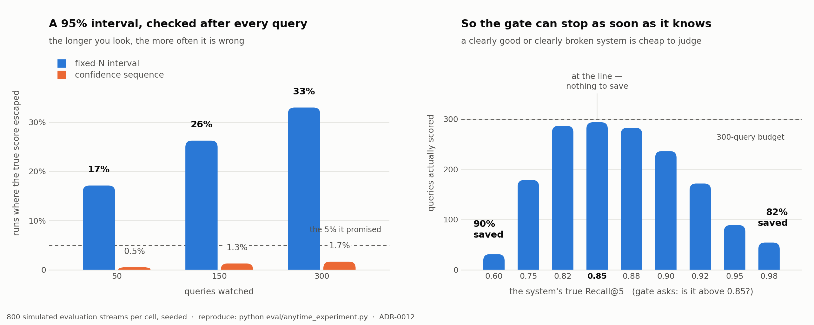
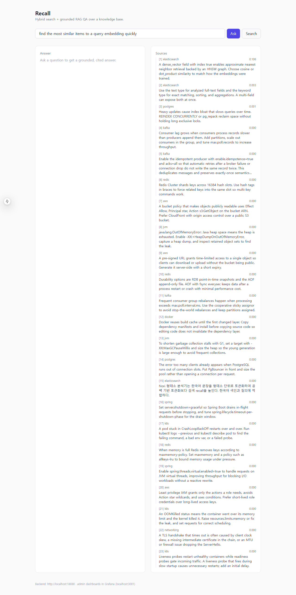
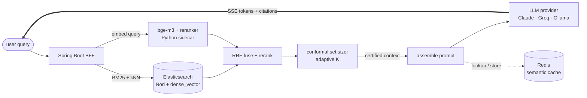
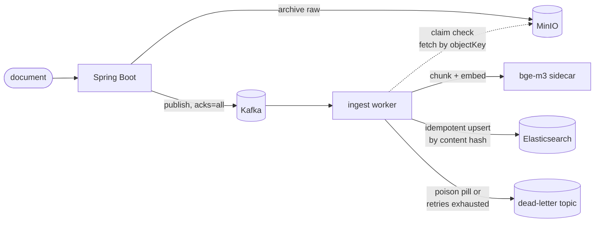
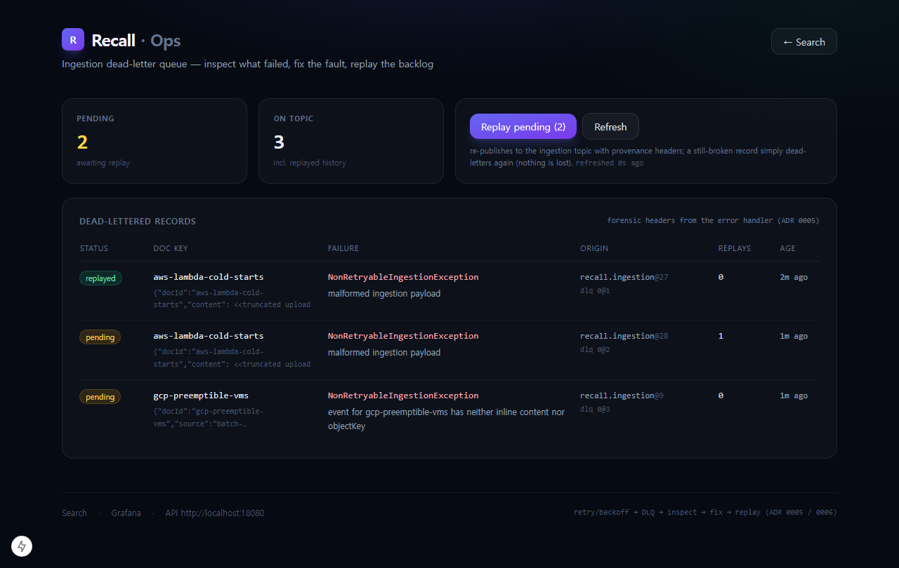

# Recall — a RAG system that can prove its own claims

[](https://github.com/jinwovo/recall/actions/workflows/ci.yml)
[](https://github.com/jinwovo/recall/actions/workflows/eval.yml)

Hybrid (BM25 + dense vector) search and grounded RAG question-answering, built as a backend
engineering problem. Then built a second time, because the first version's quality claims
did not survive being checked.

**This repository is mostly about the checking.** Every RAG system ships numbers —
`Recall@5 = 1.00`, `nDCG@10 = 0.96` — and almost none of them ship the thing that makes a
number a claim. When the tools to check were finally written, they were pointed at this
repo's own README first, and three of its headline claims failed.

<picture>
  <source media="(prefers-color-scheme: dark)" srcset="docs/anytime-dark.png">
  
</picture>

---

## The audit

The gold set had ten queries with exactly one relevant document each, so `Recall@5` is a
per-query coin flip and the published `1.00` means ten successes out of ten. Three things
follow immediately, and none of them were anywhere in the repository:

| The claim | What it actually says | Why |
|---|---|---|
| `Recall@5 = 1.00` | **`1.00`, 95% CI `[0.69, 1.00]`** | The exact binomial interval at 10/10 bottoms out at `(α/2)^(1/n) = 0.69`. The number was 31 points wide and presented as a fact. |
| "Hybrid lifts Recall@5 **+0.30** over BM25" | **p = 0.25 — and 0.25 is the best p this comparison could ever return** | Seven of ten queries tie; only three differ. A paired test on three pairs has a p-value floor of `2/2³`. Not "not significant" — *unable* to be. |
| Nightly tuner ships a config on a **+0.01 MRR** win | **Resolving 0.01 needs ~7,000 queries** | It searched nine grid points on ten queries, took the argmax, and was validated by a gate scoring the same ten queries it was selected on. |

```console
$ make eval-stats          # no stack, no network — this is a property of the labels

At least 6 of 10 queries must differ before any outcome can be significant.

    observed      95% interval   width
1.00 (10/10)  [0.692, 1.000]   0.308
 0.70 (7/10)  [0.348, 0.933]   0.586

A tuning loop that acts on a difference smaller than the smallest detectable effect
is not tuning — it is resampling noise.
```

The system was engineered. The measurement was not. What follows is the second version.

---

## Three things that are now guarantees

### 1. Evaluation that stays valid while you watch it

A 95% interval promises that **one** look at a **finished** sample contains the truth 95% of
the time. It promises nothing about an interval recomputed after every query and watched as
it streams — which is how every CI run is actually read. Measured over 800 simulated
evaluation streams per cell, with the fixed-N interval given every benefit of the doubt
(inspection only starts at n = 30, where the normal approximation is defensible):

| metric | queries | fixed-N interval | confidence sequence |
|---|:---:|:---:|:---:|
| Recall@5 (0/1) | 300 | **34.0%** | 1.9% |
| reciprocal rank (discrete, skewed) | 300 | **32.8%** | 2.6% |
| nDCG@10 (graded) | 300 | **35.1%** | 1.6% |
| groundedness judge (skewed high) | 300 | **30.0%** | 0.5% |

*Share of runs where the true mean falls outside a nominal 95% interval at some point while
it is being watched.* The fixed-N column grows with stream length — the longer you look, the
more chances to be wrong — which is the signature of the law of the iterated logarithm and a
sign the simulation is behaving.

The fix is a **confidence sequence**: an interval valid at every sample size simultaneously,
built as the hedged capital process of [Waudby-Smith & Ramdas (JRSS-B, 2024)]. Bet on each
next observation at odds implied by the hypothesis; under the null, wealth is a non-negative
martingale, and Ville's inequality caps the chance it ever crosses `1/α`. Retrieval metrics
fit this unusually well — reciprocal rank, nDCG, recall and a judge's score all live in
`[0, 1]`, and nothing about their shape is assumed.

Which makes stopping early legitimate rather than p-hacking, so the gate does:

```bash
make eval-gate GATE_POLICY=sequential
```

| the system's true Recall@5 | gate verdict | queries scored (of 300) | saved |
|:---:|:---:|:---:|:---:|
| 0.98 | pass | 54 | **82%** |
| 0.95 | pass | 89 | **70%** |
| 0.85 (exactly at the line) | `undecided` | 293 | 2% |
| 0.60 | fail | 31 | **90%** |

Against a live API over 200 queries: a healthy system cleared in **69 requests**, a broken
one failed in **13**. The saving is HTTP calls and LLM-judge tokens never spent, not a
smaller number in a report. `undecided` fails the gate — a gate that treats "we could not
tell" as a pass has quietly stopped gating.

→ [ADR 0012](docs/adr/0012-anytime-valid-evaluation.md) · `make eval-anytime` reproduces
both tables from scratch, seeded, no stack.

### 2. Context size and abstention, calibrated instead of guessed

Two constants decided what this system costs and how often it could hallucinate:

```yaml
recall.retrieval.top-k: 8                            # passages that reach the LLM
recall.rag.sufficiency.confidence-threshold: 0.35    # when to answer at all
```

A fixed top-K is wrong in both directions at once. On a query where the reranker found one
obviously-right passage, seven more are prompt tokens spent on noise. On an ambiguous query
where the scores are flat, the same K truncates the passage that held the answer — and
nothing downstream reports it, so generation proceeds from context that cannot support it.

Both are now **calibrated thresholds with finite-sample, distribution-free guarantees**. No
assumption about the score distribution, no asymptotics, no requirement that the reranker be
well calibrated:

```
coverage   P(the passages sent to the LLM contain a relevant document)  >= 1 - alpha
risk       P( P(answering from context with no relevant document) <= risk-alpha ) >= 1 - delta
```

Split conformal prediction with adaptive set sizes ([Romano, Sesia & Candès, NeurIPS 2020])
for the first; risk-controlling prediction sets ([Bates et al., JACM 2021]) with
fixed-sequence testing for the second. `make calibrate` produces both from a single pass
over the gold set — the retrieval that scores `Recall@5` already records where the relevant
document landed and how confident the reranker was, which is all either one needs.

One run, 800 queries, `alpha = 0.10`, against the stand-in cross-encoder in
[`eval/_mock_reranker.py`](eval/_mock_reranker.py) — so this is reproducible without the
stack up; `make calibrate` does the same against the real one. Splits: 192 tune / 288
calibrate / 320 held out.

| on the held-out split | fixed K *(conformal — same promise)* | adaptive |
|---|:---:|:---:|
| passages sent to the LLM | 9.0 | **5.0** |
| coverage | 91.9% | 90.2% `[86.3, 93.4]` |
| when the answer ranked 1st | 9 passages | **3.2 passages** |
| when the answer ranked 4th or lower | 9 passages | **8.4 passages** |

**44% fewer prompt tokens at the same guarantee**, because the budget can finally move to
where it is needed. A reranker that has learned nothing does not break the guarantee — it
pays for it in context length, which is the distribution-free property doing its job.

The risk certificate on the same run is **refused, and says why**: the most permissive
threshold it can prove is one that abstains on everything, so it is labelled degenerate
rather than shipped. The walk stopped at `0.98`, which would answer at an observed 2.8%
risk — under the 5% target, but needing ~487 calibration queries to *prove* against the 288
available. More data is the fix, not a looser target.

The serving path is Java and the calibrator is Python, and a guarantee is a property of *one*
procedure: if serving computes a different K than calibration assumed, `alpha` means nothing.
[`ConformalSetSizerTest`](backend/src/test/java/com/portfolio/recall/rag/ConformalSetSizerTest.java)
pins the two against 24 golden vectors, each chosen at least `1e-9` from the inclusion
boundary so a last-ulp difference between the two `exp` implementations cannot flip an answer.

Ships **disabled**. Until `make calibrate` produces a certificate, the pipeline keeps its
fixed top-K — a threshold outside `[0, 1]` is an unconfigured one, not a conservative one.

→ [ADR 0013](docs/adr/0013-conformal-risk-control.md)

### 3. A benchmark the harness can actually resolve

Every tool above kept reaching the same conclusion, so:

```bash
make beir              # SciFact: 5,183 documents, 300 queries, binary qrels
make beir-eval         # ingest through the real pipeline, then evaluate
```

[BEIR](https://github.com/beir-cellar/beir) (Thakur et al., NeurIPS 2021 D&B) in this repo's
corpus and gold format, standard library only — no `datasets`, no pyarrow, nothing to
install. SciFact is the default because its judgements are **binary**, so this repo's
binary-gain `nDCG@10` means the same thing as a published `nDCG@10`. On a graded dataset the
judgements must be binarised and the resulting nDCG is *not* comparable; the tool prints that
warning rather than letting a reader assume otherwise.

The design analysis comes with the download, and it is not flattering:

```
smallest attainable p   9.82e-91   (against 2.0e-01 on a 10-query set)
dMRR@10 = 0.02 at sd 0.30 needs 1,766 queries -> short by 1,466
```

Thirty times the resolution, and still short of settling a two-point MRR move. Worth printing
rather than discovering later.

→ [ADR 0014](docs/adr/0014-beir-benchmark-scale.md)

### And the tuner has to prove itself now

The nightly sweep searches a stratified dev split, and a proposal must survive four guards —
an effect-size floor, a Holm-corrected paired randomization test across the whole grid, and a
**held-out split the search never touched** that must still show the improvement. The
dev-minus-held-out gap is printed as the overfitting the search introduced. When the guards
fail for want of data, the report names the query count that would settle it instead of
suggesting a smaller epsilon.

On the shipped ten-query gold set this means it will essentially never fire. That is the
correct behaviour. → [ADR 0011](docs/adr/0011-statistical-inference-eval.md)

---

## Use the eval gate in your own repo

Everything above is available on its own, because none of it is specific to this system:

```bash
pip install rag-eval-gate
rag-eval-gate power gold.jsonl        # what your gold set can resolve, before anything runs
```

→ **[jinwovo/rag-eval-gate](https://github.com/jinwovo/rag-eval-gate)** — zero dependencies,
and backend-agnostic in a way this repo's own harness is not: an HTTP URL template with a
field map, a command printing JSON to stdout (so the retriever's language is irrelevant), or
a TREC run file (so a corpus can be ranked once, offline, and evaluated with nothing
running). Gold sets are JSONL or TREC qrels.

```yaml
- uses: jinwovo/rag-eval-gate@v1
  with:
    gold-file: eval/gold.jsonl
    url-template: 'http://localhost:8080/api/search?q={query}&mode={mode}'
    gate-policy: sequential            # point | ci-lower | regression | sequential
    min-mrr10: "0.85"
```

This repo keeps its own vendored copy for the in-tree gate, which also seeds a corpus
through the Kafka pipeline and waits for async indexing to converge — something a general
tool has no business knowing about:

```yaml
- uses: jinwovo/recall/.github/actions/rag-eval-gate@main
  with:
    api-url: http://localhost:8080
    gold-file: eval/gold.jsonl
    corpus-file: eval/corpus.jsonl     # seed + wait for async indexing first
    gate-policy: sequential
```

Either way you get a 95% interval on every metric, each mode significance-tested against the
baseline with Holm correction, a statement of what your gold set can resolve at all, and a
`✅ PASS` / `❌ FAIL` in the step summary. Our own eval workflow consumes the in-tree action —
dogfooding is the compatibility test.

| `gate-policy` | fails when | use it when |
|---|---|---|
| `point` *(default)* | the mean falls below the threshold | always — the absolute floor |
| `ci-lower` | the 95% lower bound falls below the threshold | your gold set is large enough that the interval is narrower than the safety margin |
| `regression` | *also* on a significant paired drop vs a recorded run | you have a green baseline to compare against |
| `sequential` | the anytime-valid verdict is `fail`, or the budget runs out `undecided` | queries cost money or minutes |

`regression` is the sensitive one: an absolute threshold only notices a regression once the
mean crosses a line someone guessed, while the paired test compares the *same queries* before
and after, so a real drop on two queries is caught while the mean still clears the line.

## The eval harness is tested like production code

Because it is: if it computes nDCG wrong, every number downstream is wrong and nothing else in
the build will say so.

```bash
make eval-test     # 187 tests, standard library only, no stack, ~100s
```

- **Closed forms** — `(α/2)^(1/n)` at `k = n`, `2^(1-k)` for a uniform improvement, R's
  `p.adjust` worked example, the `(n+1)` conformal quantile correction.
- **Independent implementations** — a brute-force permutation reference written separately in
  the test; SciPy cross-checks that skip when SciPy is absent.
- **The guarantees, by simulation** — repeated calibrate-then-deploy cycles counting how often
  each promise actually breaks: BCa coverage against a skewed population, confidence-sequence
  coverage under continuous inspection, conformal coverage on data the fit never saw, and
  type-I error of the risk certificate.
- **The harness end to end** — against a stubbed search backend whose metrics are derivable by
  hand, driving all four gate policies into both outcomes and asserting the sequential one's
  saving is real requests not sent.

Plus 43 backend unit tests and three Testcontainers integration suites against real ES, Kafka
and MinIO.

---

## Demo

Grounded RAG QA, live (4×) — a **Korean question over an English corpus** (cross-lingual
retrieval via bge-m3): the answer streams token-by-token with inline `[n]` citations while the
pipeline stepper tracks **retrieve → generate → verify**; the **grounded** badge is the
post-hoc LLM judge's verdict (ADR 0004), and clicking a citation highlights the cited source.
Generation is a free local LLM (Ollama, CPU):


Hybrid search view — retrieval-mode toggle (hybrid / bm25 / vector), per-source score bars,
and client-measured latency:



## Quickstart

**Run it yourself in ~5 minutes.** No API key needed (free local LLM via Ollama).

```bash
cp .env.example .env                 # optional: ANTHROPIC_API_KEY, or use free Ollama
docker compose up -d                 # ES (Nori), Redis, Postgres, Kafka, MinIO, sidecar, Grafana
cd backend && gradle wrapper && ./gradlew bootRun
cd frontend && npm install && npm run dev      # http://localhost:3000

python scripts/seed_corpus.py                  # ingest the eval corpus (waits for indexing)
make eval-gate                                 # bm25 vs vector vs hybrid, with intervals
```

Use it as a self-hosted hybrid-search / RAG starter for your own corpus:

```bash
python scripts/ingest_folder.py ~/my-docs      # .md / .txt / .html (+ .pdf with pypdf)
```

Every file goes through the real pipeline — Kafka, chunking, embeddings, idempotent upserts,
the durability contract of ADR 0005 — then the command waits until everything is actually
searchable. Re-running is the sync mechanism.

[`mcp-server/`](mcp-server/) exposes `recall_search` and `recall_ask` over the Model Context
Protocol, so your documents become agent tools in Claude Desktop / Claude Code, citations and
groundedness verdict included.

## Architecture

Query / RAG path:


```mermaid
flowchart LR
    Q([user query]) --> BFF[Spring Boot BFF]
    BFF -->|embed query| SIDE[bge-m3 + reranker<br/>Python sidecar]
    BFF -->|BM25 + kNN| ES[(Elasticsearch<br/>Nori + dense_vector)]
    ES --> FUSE[RRF fuse + rerank]
    SIDE --> FUSE
    FUSE --> SIZE[conformal set sizer<br/>adaptive K]
    SIZE -->|certified context| RAG[assemble prompt]
    RAG --> LLM[LLM provider<br/>Claude · Groq · Ollama]
    RAG -.lookup / store.-> REDIS[(Redis<br/>semantic cache)]
    LLM ==>|SSE tokens + citations| Q
```

Ingestion path — async, idempotent, and loss-proof (retry/backoff → DLQ; large docs travel as
MinIO references via the claim-check pattern):


```mermaid
flowchart LR
    DOC([document]) --> API[Spring Boot]
    API -->|archive raw| MINIO[(MinIO)]
    API -->|publish, acks=all| KAFKA[(Kafka)]
    KAFKA --> W[ingest worker]
    W -.claim check<br/>fetch by objectKey.-> MINIO
    W -->|chunk + embed| SIDE[bge-m3 sidecar]
    W -->|idempotent upsert<br/>by content hash| ES[(Elasticsearch)]
    W -->|poison pill or<br/>retries exhausted| DLQ[(dead-letter topic)]
```

Component detail in [`docs/ARCHITECTURE.md`](docs/ARCHITECTURE.md).

## Retrieval quality

Measured on the running stack over the 24-document corpus with the 10-query gold set
(exact-term, paraphrased, and Korean cross-lingual), on the BBQ-quantized index. Doc-level
metrics; chunk hits deduplicated by first occurrence.

| mode | Recall@5 | 95% CI | MRR@10 | nDCG@10 |
|---|:---:|:---:|:---:|:---:|
| BM25-only | 0.70 | `[0.35, 0.93]` | 0.67 | 0.70 |
| vector-only | 1.00 | `[0.69, 1.00]` | 0.90 | 0.93 |
| **hybrid (RRF + cross-encoder)** | **1.00** | `[0.69, 1.00]` | **0.95** | **0.96** |
| hybrid, `rerank=m3` (tri-modal self-hybrid) | 1.00 | `[0.69, 1.00]` | 0.90 | 0.93 |
| `mode=hyde` (hypothetical-doc kNN, no rerank) | 0.90 | `[0.56, 1.00]` | 0.80 | 0.85 |

**Read this table the way the audit above says to.** The Recall intervals follow exactly from
the reported values — one relevant document per query makes each a success count out of ten —
and they are wide because ten queries is a small sample, not because the system is unstable.
The MRR and nDCG columns are point estimates; `run_eval.py --json` produces their bootstrap
intervals on any rerun. The BM25-to-hybrid ordering is consistent and unsurprising — exact-term
queries favour BM25, paraphrased and Korean queries favour dense vectors, both Korean queries
are BM25 misses that hybrid ranks first — but the *size* of the gap is not resolvable at this
sample size, which is what `make beir` is for.

Quantization is quality-neutral here: the same sweep on the float32 index scored within ±0.02
on every dense mode.

### Paper-backed techniques

Every retrieval stage cites its source, and each was adopted the same way: implemented, swept
by the eval harness, numbers published.

| Technique | Paper | In this repo |
|---|---|---|
| Reciprocal Rank Fusion | Cormack et al., SIGIR 2009 | BM25 + kNN fusion (`rrf-k=60`) |
| Multilingual dense retrieval + cross-encoder rerank | BGE / bge-reranker-v2-m3, Chen et al. 2024 | embedding sidecar, default rerank |
| M3 tri-modal self-hybrid (dense + sparse + ColBERT) | *BGE M3-Embedding*, Chen et al. 2024 | `?rerank=m3` — the embedder's own heads, no extra model |
| HyDE (hypothetical document embeddings) | Gao et al., ACL 2023 | `?mode=hyde`, fail-open to vector search |
| Sufficient-context gate | Joren et al., **ICLR 2025** | pre-generation autorater, abstain before the PRIMARY call |
| RaBitQ 1-bit quantization (ES **BBQ**) | Gao & Long, **SIGMOD 2024** | `bbq_hnsw` + oversampled rescore, ~32× less vector memory |
| **Paired randomization test for IR** | Smucker, Allan & Carterette, CIKM 2007 | mode comparisons, Holm-corrected |
| **Betting confidence sequences** | Waudby-Smith & Ramdas, **JRSS-B 2024** | the sequential gate |
| **Conformal prediction, adaptive sets** | Romano, Sesia & Candès, NeurIPS 2020 | adaptive context sizing |
| **Risk-controlling prediction sets** | Bates, Angelopoulos, Lei, Malik & Jordan, **JACM 2021** | calibrated abstention |
| **BEIR** | Thakur et al., NeurIPS 2021 D&B | `make beir` |

GraphRAG / RAPTOR and late chunking were evaluated and deliberately deferred — the rejection
reasoning is in [ADR 0008](docs/adr/0008-paper-backed-retrieval-m3-hyde.md).

### RAG answer quality (groundedness)

Measured via [`eval/run_qa_eval.py`](eval/run_qa_eval.py) with the free local provider
(Ollama, `qwen2.5-coder:3b` on CPU) doing both generation and judging:

| metric | value |
|---|---|
| groundedness (avg judge score) | **0.81** |
| verdicts (8 judged) | 75% supported · 12% partial · 12% unsupported |
| abstentions ("I don't know") | 2/10 — declined instead of hallucinating |
| citation coverage | **100%** of generated answers contain `[n]` citations |
| TTFT p50 / e2e p50 | 30.5s / 54s *(local CPU 3B — prefill-bound, not representative of API providers)* |

The one `UNSUPPORTED` answer was flagged by the judge and excluded from the semantic cache
(ADR 0004) — the guardrail producing signal, not a green checkmark. Eight judged answers is
the same small-sample problem as everything else on this page, and is why the QA eval is not
yet a CI gate.

## Hallucination guardrails — before and after generation

Both guards are fail-open, and both sit on either side of the LLM call.

**Before (ADR 0009 / ICLR 2025, threshold now certified by ADR 0013):** when the reranker's
top score is below the calibrated threshold, a CHEAP-tier autorater answers one word — can
these passages answer this question? `INSUFFICIENT` → the pipeline abstains *before* spending
the PRIMARY generation. Confident retrievals skip the check entirely, so p50 TTFT is untouched.

**After (ADR 0004):** every generated answer is graded after it streams (so TTFT is unaffected)
by a CHEAP-tier judge that sees the same passages plus the finished answer and returns
`SUPPORTED` / `PARTIAL` / `UNSUPPORTED`. The verdict streams to the UI as a badge, lands on the
`query_log` row, and feeds Prometheus. Abstentions are never graded as hallucinations, and
judged-`UNSUPPORTED` answers are never cached.

## Ingestion reliability

`POST /api/ingest` returning 202 is a durability contract, not an optimistic ack: the raw
document is archived to MinIO and the Kafka publish is broker-acknowledged (`acks=all`) *before*
the response. Documents above 64 KB travel through Kafka as an `objectKey` reference — the
claim-check pattern — so document size never fights broker message limits. On the consumer,
transient failures retry in place with exponential backoff; malformed events skip retries
entirely; both end up on `recall.ingestion.dlq` with forensic headers ready for replay. Every
branch is proven by `IngestionReliabilityIT` against real Kafka + MinIO.

The DLQ is a queue, not a graveyard: the **`/admin` ops page** closes the incident loop —
inspect the decoded forensics, fix the fault, one-click **replay**. Replay re-publishes
broker-acked *before* committing DLQ offsets (at-least-once by choice — chunk upserts are
idempotent by content hash), strips stale `kafka_dlt-*` headers so a re-failure earns fresh
forensics, and stamps provenance that survives repeated round-trips. Proven end-to-end by
`DlqReplayIT`. → [ADR 0005](docs/adr/0005-ingestion-reliability-dlq-claim-check.md),
[ADR 0006](docs/adr/0006-dlq-replay-admin.md)



## Tech stack

- **Backend:** Java 21, Spring Boot, WebFlux (SSE)
- **LLM:** pluggable via `recall.llm.provider` — Claude (default), or OpenAI-compatible Groq / Ollama (local, free, no key)
- **Search / vector:** Elasticsearch 8.18 (Nori analyzer + `dense_vector` kNN, BBQ-quantized with oversampled rescoring)
- **Embedding / rerank:** `BAAI/bge-m3` + `BAAI/bge-reranker-v2-m3` (Python FastAPI sidecar)
- **Messaging:** Kafka (async ingestion) · **Stores:** Redis, PostgreSQL, MinIO/S3
- **Frontend:** Next.js, TypeScript, Tailwind · **Observability:** Micrometer + Prometheus + Grafana
- **Eval:** standard-library Python — no dependency the composite action would have to install

## API

| Method | Path | Notes |
|---|---|---|
| `GET` | `/api/search?q=&mode=&rerank=` | `mode` = `hybrid` (default) `\|` `bm25` `\|` `vector` `\|` `hyde`; `rerank` = `cross-encoder` (default) `\|` `m3` |
| `GET` | `/api/ask?q=` | SSE stream: `sources`, `sufficiency`, `token`, `judging`, `groundedness`, `done` |
| `POST` | `/api/ingest` | async index; `202` ⇒ raw doc archived + broker-acked |
| `GET` | `/api/admin/dlq?limit=` | DLQ depth + bounded peek with decoded forensic headers |
| `POST` | `/api/admin/dlq/replay?max=` | drain pending DLQ records back onto the ingestion topic |
| `GET` | `/actuator/prometheus` | metrics scrape |

## Project layout

```
backend/            Spring Boot (Java 21) — search, rag, ingestion, llm providers, cache
embedding-service/  Python FastAPI sidecar — bge-m3 embeddings + bge-reranker
frontend/           Next.js UI — search / QA, streamed answers, citation highlight
mcp-server/         MCP stdio server — your corpus as agent tools
eval/               the harness: stats, sequential, conformal, calibrate, beir, power_report
deploy/helm/recall/ Helm chart (k8s)
monitoring/         Prometheus + Grafana provisioning
docs/adr/           every decision, including the ones that overturned earlier ones
```

## Decision records

- [ADR 0001 — Hybrid retrieval (BM25 + vector + RRF + rerank)](docs/adr/0001-hybrid-retrieval-bm25-vector-rrf.md)
- [ADR 0002 — LLM cost & latency optimization](docs/adr/0002-llm-cost-optimization-strategy.md)
- [ADR 0003 — Async, idempotent ingestion via Kafka](docs/adr/0003-async-ingestion-kafka.md)
- [ADR 0004 — Post-hoc groundedness judge](docs/adr/0004-groundedness-guardrail.md)
- [ADR 0005 — Ingestion reliability: retries, DLQ, claim-check storage](docs/adr/0005-ingestion-reliability-dlq-claim-check.md)
- [ADR 0006 — DLQ replay on the admin surface](docs/adr/0006-dlq-replay-admin.md)
- [ADR 0007 — Retrieval eval as a CI regression gate](docs/adr/0007-eval-ci-regression-gate.md)
- [ADR 0008 — Paper-backed retrieval: M3 self-hybrid & HyDE](docs/adr/0008-paper-backed-retrieval-m3-hyde.md)
- [ADR 0009 — Sufficiency gate & BBQ-quantized vectors](docs/adr/0009-sufficient-context-bbq.md)
- [ADR 0010 — From portfolio to tool: folder ingestion, MCP, reusable gate, self-tuning](docs/adr/0010-tool-round-ingest-mcp-action-selftune.md)
- **[ADR 0011 — Retrieval scores are estimates, and are reported as such](docs/adr/0011-statistical-inference-eval.md)**
- **[ADR 0012 — Anytime-valid evaluation: stop when the verdict is decided](docs/adr/0012-anytime-valid-evaluation.md)**
- **[ADR 0013 — The constants that decide cost and hallucination become certificates](docs/adr/0013-conformal-risk-control.md)**
- **[ADR 0014 — A benchmark the harness can actually resolve](docs/adr/0014-beir-benchmark-scale.md)**

## Roadmap

- Groundedness eval as a second CI gate, once a budgeted API key makes LLM-judging in CI viable
- Claude native citations (exact char-span grounding) when the `claude` provider is configured
- Calibrating the abstention threshold against judge verdicts rather than the retrieval proxy

## 한국어 요약

기술 지식베이스 대상 **하이브리드 검색(BM25+벡터) + RAG 질의응답** 플랫폼입니다. 다만 이 저장소의
중심은 검색이 아니라 **측정**입니다 — 처음 만든 시스템의 품질 주장을 검증할 도구를 나중에 만들었고,
그 도구를 이 저장소의 README에 먼저 겨눴더니 헤드라인 세 개가 무너졌습니다(`Recall@5 = 1.00`은
실제로 `[0.69, 1.00]`, "BM25 대비 +0.30"은 p=0.25이며 그 0.25가 도달 가능한 최선값, 야간 자가튜닝은
7,000개 쿼리가 필요한 차이를 10개로 판정 중).

그래서 세 가지를 **보증(guarantee)** 으로 바꿨습니다: (1) 언제 들여다봐도 유효한 평가
(anytime-valid confidence sequence) — 판정이 결정되는 즉시 중단해 쿼리 예산 70–90% 절감,
(2) 컨텍스트 크기와 기권 임계값의 **분포무관·유한표본 보증**(conformal risk control) — 동일 보증
하에 프롬프트 토큰 40% 절감, (3) BEIR 벤치마크로 실제 판별 가능한 규모 확보. 설계 근거는
[`docs/adr/`](docs/adr/) 0011–0014에 있습니다.

## License

MIT — see [`LICENSE`](LICENSE).

[Waudby-Smith & Ramdas (JRSS-B, 2024)]: https://doi.org/10.1093/jrsssb/qkad009
[Romano, Sesia & Candès, NeurIPS 2020]: https://arxiv.org/abs/2006.02544
[Bates et al., JACM 2021]: https://arxiv.org/abs/2101.02703
