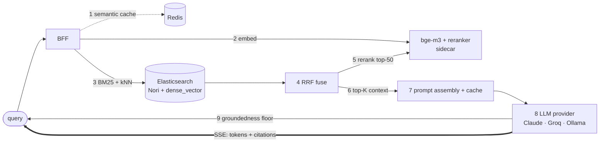
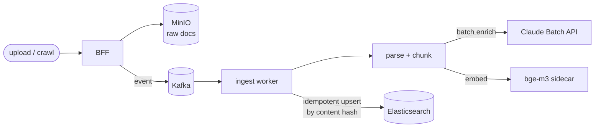

# Architecture

Component design and data flow. Decisions with trade-offs live in [`adr/`](adr/).

## Components

| Component | Responsibility | Tech |
|---|---|---|
| **BFF / API gateway** | REST + SSE surface; orchestration | Spring Boot (WebFlux) |
| **Search service** | Hybrid retrieval: BM25 (Nori) + dense kNN, RRF fuse, rerank | ES + sidecar |
| **RAG service** | Prompt assembly, prompt caching, LLM call, `[n]` citations, groundedness guard, SSE | pluggable LLM |
| **LLM provider** | Claude (default) / Groq / Ollama via `recall.llm.provider` | anthropic-java / OpenAI-compatible |
| **Ingestion service** | Fetch → chunk → embed → index; async + idempotent | Kafka workers |
| **Semantic cache** | Query embedding → Redis cosine match → serve cached answer | Redis |
| **Eval / cost** | Retrieval & RAG metrics, token/cost ledger | Postgres + Micrometer |
| **Embedding sidecar** | `bge-m3` embeddings, `bge-reranker-v2-m3` rerank | Python FastAPI |

## Query / RAG path



1. (optional) rewrite/classify the query with the cheap model tier.
2. semantic-cache lookup in Redis; on a cosine hit above threshold, return the cached answer.
3. embed the query once (reused as the cache key and for kNN).
4. retrieve in parallel: BM25 over the Nori-analyzed field, and kNN over `dense_vector`.
5. fuse the two ranked lists with Reciprocal Rank Fusion, then cross-encoder rerank.
6. keep the top-K reranked chunks as LLM context.
7. assemble the prompt; the stable system prefix carries a prompt-cache breakpoint.
8. stream the answer from the configured LLM provider over SSE, with `[n]` citations.
9. groundedness floor: no retrieved context → return "I don't know" without calling the LLM.

## Ingestion path



Idempotency: each chunk's ES `_id` is `sha256(docId + chunkIndex + content)`, so retries,
duplicate events, and concurrent ingestion converge to the same index state — no duplicates,
no loss. See [`adr/0003`](adr/0003-async-ingestion-kafka.md).

## Elasticsearch mapping (sketch)

```jsonc
{
  "settings": { "analysis": { "analyzer": { "korean": { "type": "nori" } } } },
  "mappings": {
    "properties": {
      "docId":       { "type": "keyword" },
      "chunkIndex":  { "type": "integer" },
      "content":     { "type": "text", "analyzer": "korean" },   // BM25
      "embedding":   { "type": "dense_vector", "dims": 1024, "index": true, "similarity": "cosine" },
      "lang":        { "type": "keyword" },
      "source":      { "type": "keyword" },
      "contentHash": { "type": "keyword" }
    }
  }
}
```

## Cost & latency design

- **Tiering** — cheap model for rewrite/classify, primary for answers. See [`adr/0002`](adr/0002-llm-cost-optimization-strategy.md).
- **Prompt caching** — stable system prefix carries a `cache_control` breakpoint; verify `cache_read_input_tokens > 0`.
- **Semantic cache** — Redis cosine over query embeddings, threshold `recall.semantic-cache.threshold`.
- **Batch API** — ingestion enrichment runs off the request path at reduced cost.
- **SSE** — stream answers; measure TTFT separately from total latency.
- **Pluggable provider** — Claude (paid, native citations), Groq (free tier), or Ollama (local, free).

## Observability

- Micrometer → Prometheus → Grafana (dashboard provisioned under `monitoring/`).
- Custom metrics: `recall_retrieval_latency` (by mode), `recall_llm_tokens_total{model,type}`,
  `recall_semantic_cache_hits_total`, `recall_ingestion_docs_total`/`_chunks_total`.
- Per-question rows persisted to Postgres (`query_log`): latency, cache hit, source count.

## Deployment

- **Dev:** Docker Compose (this repo).
- **Prod:** Helm chart ([`deploy/helm/recall`](../deploy/helm/recall)) — stateless backend + embedding
  sidecar as separate deployments with health probes and ConfigMap/Secret; ES/Redis/Postgres/Kafka
  provided externally.
```
